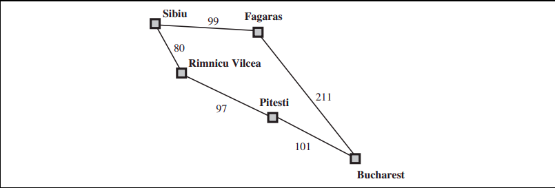

## Introduction

Uniform Cost Search (UCS) is an uninformed search algorithm for traversing a graph. UCS evaluates and explores nodes by considering the cost to reach the node (g). The algorithm selects the node with the lowest g value to explore next. We typically use a priority queue (frontier) to select the node with the lowest g value for expansion. It is a fundamental algorithm used in various applications such as pathfinding, robotics, route planning, and optimization problems due to its completeness, optimality, and optimal efficiency.

## Algorithm

The UCS Search algorithm is a pathfinding algorithm used to find the shortest path from a start node to a goal node in a graph with edge weights, taking into account the actual cost from the start node to the node. The cost function g(n) gives the actual cost to reach node n from the start node and is what the priority queue is ordered by.

STEP 1: Initialize the frontier (priority queue) with the start node 'start' and set g and f values to 0 and h(start) respectively.

STEP 2: While the frontier is not empty, select the node with the lowest f value.

STEP 3: If the selected node is the goal node, reconstruct and return the path from the start node to the goal node.

STEP 4: If the selected node is not the goal node, expand the selected node by exploring its neighbors and update the cost and parent of each neighbor. Remove the node from the frontier.

STEP 5: For each neighbor, calculate the tentative g value and update it if it is lower than the current g value.

STEP 6: Calculate the f value for each neighbor if its g value is updated and add them to the frontier if they are not already in the frontier.

STEP 7: Repeat steps 2-6 until the goal node is reached or the frontier is empty.

## Example
Reference: Section 3.4.2 of Reference 1

The problem is to get from Sibiu to Bucharest. The successors of Sibiu are Rimnicu Vilcea and
Fagaras, with costs 80 and 99, respectively. The least-cost node, Rimnicu Vilcea, is expanded
next, adding Pitesti with cost 80 + 97 = 177. The least-cost node is now Fagaras, so it is
expanded, adding Bucharest with cost 99 + 211 = 310. Now a goal node has been generated,
but uniform-cost search keeps going, choosing Pitesti for expansion and adding a second path to Bucharest with cost 80+ 97+ 101 = 278. Now the algorithm checks to see if this new path
is better than the old one; it is, so the old one is discarded. Bucharest, now with g-cost 278,
is selected for expansion and the solution is returned.

## Optimality and Completeness
**Optimality:**
UCS is optimal for non-negative edge costs. Whenever UCS selects a node n for expansion, the optimal path to that node has been found. If there exists a better path to node n, it must have passed through some other frontier node n' before reaching node n. By definition, node n' would have lower g-cost than n and would have been selected first. Therefore, if UCS selects n for expansion, it has evaluated and discarded any potential paths to n that are not optimal. 

**Completeness:**
UCS does not care about the number of steps  a path has, but only about their total cost. It will get stuck in an infinite loop if there is a path with an infinite sequence of zero cost actions. Completeness if guaranteed provided the cost of every step exceeds some small positive constant $\epsilon$.

## Space and Time Complexity
Let $b$ be the branching factor of the graph. Let $C*$ be the cost of the optimal solution and assume that every action costs at least $\epsilon$. Then the algorithm's worst time and space complexity is $O(b^{1 + \lfloor C^*/\epsilon \rfloor})$. This is because in the worst case, the optimal path is a series of small steps where each step size is the minimum possible value ($\epsilon$). When all step costs are equal, $b^{1 + \lfloor C^*/\epsilon \rfloor}$ becomes $b^{1+d}$ where d is the depth of the goal node. This is similar to breadth first search, except that the latter stops as soon as it generates a goal node, whereas UCS stops when it selects the goal node for expansion.

## Advantages
**Optimality:** UCS guaranteed finding the optimal solution in terms of cost, provided that the step costs are non-negative.

**Completeness:** UCS is complete, meaning it will always find a solution if one exists, as long as the step costs are greater than some small positive constant.

**Flexibility:** UCS can handle graphs with varying edge costs and does not require any assumptions about the structure of the graph other than non-negative edge costs. This makes it suitable for a wide range of problems.

## Disadvantages
**Time Complexity:** UCS can have a high time complexity, especially when dealing with graphs with high branching factors or when the optimal solution is deep in the search tree. Its time complexity is very high in cases where UCS explores large trees of small steps before exploring paths involving large and
perhaps useful steps.

**Space Complextiy:** UCS requires storing all explored nodes in memory to determine the optimal path. In scenarios with large graphs or limited memory resources, this can become a significant drawback, as the memory usage increases with the size of the search space.

**Sensitivity to Edge Costs:**
 UCS assumes that the step costs between nodes are non-negative. If there are negative edge costs or if the cost of reaching a node changes dynamically during the search, UCS may not guarantee optimal results.

 **Inefficiency with Uniform Costs:** While UCS excels in finding optimal solutions when step costs vary, it can be inefficient in scenarios where all step costs are uniform. In such cases, other search algorithms like Breadth First Search may perform better.

 **Lack of Heuristic Information:** UCS does not utilize any heuristic information about the problem domain. While this ensures optimality, it may lead to suboptimal performance in domains where heuristic information can guide the search more efficiently, such as in informed search algorithms like A*.

